# Brain Tumor Classification & Benchmarking Pipeline

Complete Deep Learning and Machine Learning pipeline for brain tumor classification from MRI images (`.pt` tensor files), combining state-of-the-art architectures, Transfer Learning, attention mechanisms (CBAM), Vision Transformers, and explainability analysis (XAI).

---

## Project Objective

The main objective is to rigorously design, train, evaluate, and compare different families of models for binary/clinical detection of brain tumors (Healthy vs Tumor):

1. **Classical Machine Learning Models** on tabular features (with PCA and SMOTE).
2. **Custom CNNs** (SimpleCNN, DeepCNN, and CNNs with spatial and channel attention blocks **CBAM**).
3. **Transfer Learning** (DenseNet-121 and ResNet-50 with locally pre-trained weights).
4. **Vision Transformer (ViT-B/16)** for global attention.
5. **Explainable AI (XAI)** via **Grad-CAM** to validate the clinical relevance of targeted regions.

---

## Project Organization

```text
brain-tumor-project/
│
├── data/
│   └── processed/
│       └── augmented_images/
│           ├── yes/          # .pt tensors with tumor
│           └── no/           # .pt healthy tensors
│       └── augmented_images_224x224/
│           ├── yes/          # .pt tensors with tumor
│           └── no/           # .pt healthy tensors
│   └── raw/
│       └── augmented_images/
│           ├── yes/          # .pt tensors with tumor
│           └── no/           # .pt healthy tensors
│
├── models/                   # Local model weights (.pth)
│   ├── SimpleCNN_Trained.pth
│   ├── DeepCNN_Trained.pth
│   ├── Attention_CNN_Trained.pth
│   ├── resnet50_retrained.pth
│   └── vit_b_16-c867db91.pth
│
├── notebooks/                # Jupyter Notebooks by step
│   ├── 01_exploration_dataset.ipynb
│   ├── 02_preprocessing.ipynb
│   ├── 03_machine_learning_classique.ipynb
│   ├── 04_deep_learning_cnn.ipynb
│   ├── 05_transfer_learning.ipynb
│   ├── 06_Visual_Transformer.ipynb
│   ├── 07_Global_Résult_Comparison.ipynb
│   └── 08_Explanability_AI.ipynb
│
├── src/                      # Reusable Python modules
│   ├── data_loader.py
│   ├── evaluation.py
│   ├── models.py           
│   ├── preprocessing.py       
│   ├── training.py          
│   └── visualization.py          
│
├── docs/
│   └── images/               # Result plots exported from the notebooks
│
├── .env                      # Environment variables
└── README.md                 # Project documentation
```

---

## Results

All numbers below are copied from the executed outputs of the notebooks in `notebooks/` (and from `data/processed/ml_benchmark_metrics.csv` for the classical models). The figures in `docs/images/` are the plots produced by those same notebooks.

### At a glance

| | |
|---|---|
| **Best overall model** | Vision Transformer (ViT-B/16): 76 / 76 test images correct |
| **Best CNN** | ResNet-50 (transfer learning): 98.68% accuracy, **0 missed tumors** |
| **Best model trained from scratch** | DeepAttentionCNN with CBAM blocks: 93.42% accuracy |
| **Best classical ML model** | Extra Trees on 30 PCA features: 91.94% accuracy |
| **Main caveat** | Augmented copies of the same MRI can land in both train and test, so scores are optimistic (see [Limitations](#limitations-read-before-trusting-the-numbers)) |

### 1. Dataset

| Step | Result | Notebook |
|---|---|---|
| Raw MRI images | **253** (155 tumor / 98 healthy, ratio ≈ 61 / 39) | `01_exploration_dataset` |
| Image sizes | Very heterogeneous: 150 to 1920 px wide, 168 to 1427 px high, mixed grayscale / RGB / palette modes | `01_exploration_dataset` |
| Augmented tensors | **504** `.pt` tensors (2 random augmentations per image), saved at 32×32 and 224×224 | `02_preprocessing` |
| Tabular features | 1,033 OpenCV features per image (histograms, Laplacian texture, contour area/perimeter) | `02_preprocessing` |
| After SMOTE + Gaussian noise + PCA | 620 samples × **30 components**, keeping **98.74%** of the variance | `02_preprocessing` |

<p align="center">
  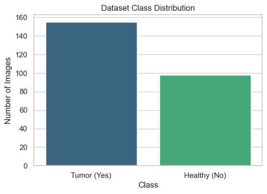
  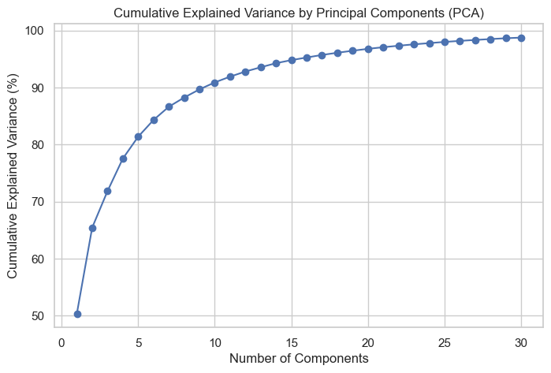
</p>

The dataset is small and imbalanced towards the tumor class, which is why the project relies on augmentation (images) and SMOTE (tabular features). 30 PCA components are enough to keep almost all the information of the 1,033 hand-crafted features.

### 2. Global benchmark

Every model is evaluated on a held-out test set: **124 samples** (62 / 62) for the classical models and **76 images** (46 tumor / 30 healthy) for the deep learning models. Missed tumors and false alarms are derived from the reported precision and recall on those test sets and match the confusion matrices plotted in the notebooks.

| Rank | Model | Family | Accuracy | Precision | Recall | F1-Score | Missed tumors (FN) | False alarms (FP) |
|---:|---|---|---:|---:|---:|---:|---:|---:|
| 1 | Vision Transformer (ViT-B/16) | Transformer | **100.00%** | **1.0000** | **1.0000** | **1.0000** | 0 / 46 | 0 / 30 |
| 2 | ResNet-50 | Transfer learning | 98.68% | 0.9787 | **1.0000** | 0.9892 | 0 / 46 | 1 / 30 |
| 3 | DeepAttentionCNN (CBAM) | CNN from scratch | 93.42% | 0.9767 | 0.9130 | 0.9438 | 4 / 46 | 1 / 30 |
| 4 | Extra Trees | Classical ML | 91.94% | 0.9062 | 0.9355 | 0.9206 | 4 / 62 | 6 / 62 |
| 5 | DeepCNN | CNN from scratch | 89.47% | 0.8654 | 0.9783 | 0.9184 | 1 / 46 | 7 / 30 |
| 6 | DenseNet-121 | Transfer learning | 89.47% | 0.8958 | 0.9348 | 0.9149 | 3 / 46 | 5 / 30 |
| 7 | MLP Classifier | Classical ML | 89.52% | 0.8769 | 0.9194 | 0.8976 | 5 / 62 | 8 / 62 |
| 8 | Random Forest | Classical ML | 88.71% | 0.8750 | 0.9032 | 0.8889 | 6 / 62 | 8 / 62 |
| 9 | SimpleCNN | CNN from scratch | 76.32% | 0.7333 | 0.9565 | 0.8302 | 2 / 46 | 16 / 30 |

*Ranked by F1-Score, as in `07_Global_Résult_Comparison`. The remaining classical models are listed in [section 3](#3-classical-machine-learning-03_machine_learning_classique).*

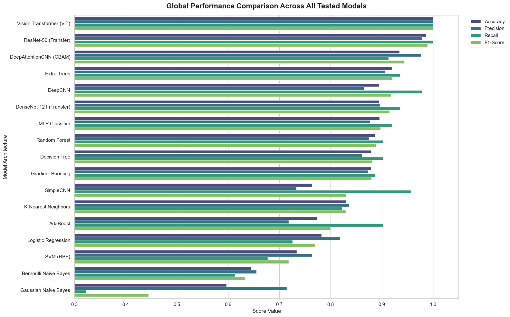

**How to read it.** In tumor screening a missed tumor (false negative) is far more costly than a false alarm, because a false alarm is caught by a radiologist while a missed tumor is not. Recall is therefore the metric to watch first, and precision second. On that criterion the two pre-trained models (ViT and ResNet-50) are the only ones that miss no tumor at all, and ResNet-50 does so with a single false alarm.

### 3. Classical machine learning (`03_machine_learning_classique`)

Eleven scikit-learn models were trained on the 30 PCA components (80 / 20 stratified split).

| Model | Accuracy | Precision | Recall | F1-Score |
|---|---:|---:|---:|---:|
| **Extra Trees** | **91.94%** | **0.9062** | **0.9355** | **0.9206** |
| MLP Classifier | 89.52% | 0.8769 | 0.9194 | 0.8976 |
| Random Forest | 88.71% | 0.8750 | 0.9032 | 0.8889 |
| Gradient Boosting | 87.90% | 0.8730 | 0.8871 | 0.8800 |
| Decision Tree | 87.90% | 0.8615 | 0.9032 | 0.8819 |
| K-Nearest Neighbors | 83.06% | 0.8361 | 0.8226 | 0.8293 |
| Logistic Regression | 78.23% | 0.8182 | 0.7258 | 0.7692 |
| AdaBoost | 77.42% | 0.7179 | 0.9032 | 0.8000 |
| SVM (RBF) | 73.39% | 0.7636 | 0.6774 | 0.7179 |
| Bernoulli Naive Bayes | 64.52% | 0.6552 | 0.6129 | 0.6333 |
| Gaussian Naive Bayes | 59.68% | 0.7143 | 0.3226 | 0.4444 |

<p align="center">
  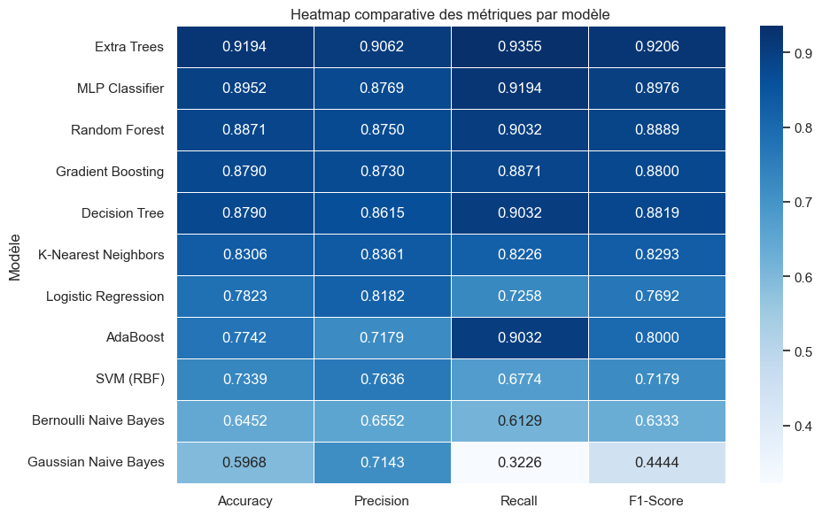
</p>

<details>
<summary>Confusion matrices of the 11 classical models</summary>

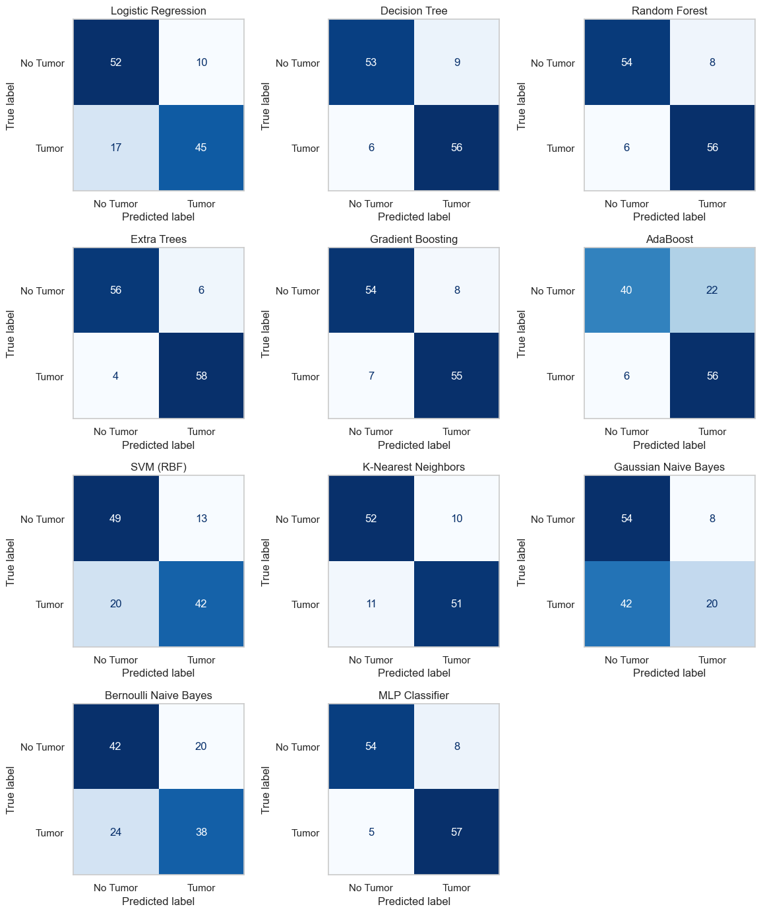

</details>

**Interpretation.**

- **Tree ensembles win.** The PCA space built from histograms, textures and contour measures is dense and non-linear. Ensembles of trees (Extra Trees, Random Forest, Gradient Boosting) capture these interactions without any linearity assumption.
- **Why Extra Trees beats Random Forest.** Extra Trees also randomizes the split thresholds, which lowers variance and makes it more robust to the synthetic SMOTE samples. It misses 4 tumors out of 62, against 6 for Random Forest.
- **The MLP comes second** because its hidden layers can model non-linear combinations of the 30 components.
- **Linear and probabilistic models struggle.** Logistic Regression and the SVM miss 17 and 20 tumors. Gaussian Naive Bayes misses 42 of 62 tumors (recall 0.32): its feature-independence assumption does not hold for correlated image features.

### 4. CNNs trained from scratch (`04_deep_learning_cnn`)

Three architectures were trained on the 32×32 tensors (70 / 15 / 15 split, AdamW, learning rate 1e-3, ReduceLROnPlateau, early stopping with patience 20).

| Model | Best validation accuracy | Test accuracy | Test recall | Test F1 |
|---|---:|---:|---:|---:|
| SimpleCNN | 80.26% | 76.32% | 0.9565 | 0.8302 |
| DeepCNN | 93.42% | 89.47% | 0.9783 | 0.9184 |
| **DeepAttentionCNN (CBAM)** | **96.05%** | **93.42%** | 0.9130 | **0.9438** |

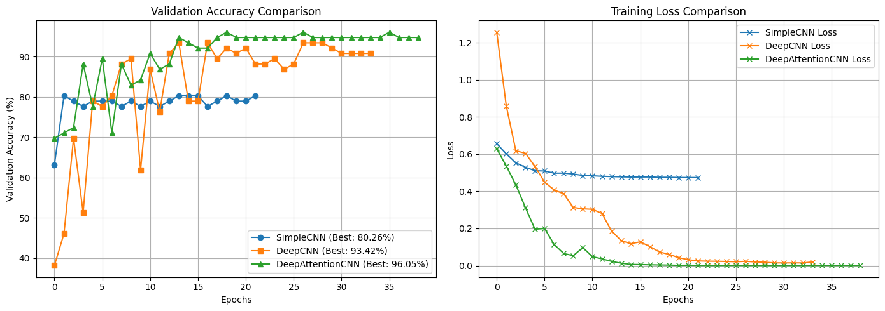

**Interpretation.**

- **SimpleCNN underfits.** Its training loss plateaus around 0.47 and it stops at epoch 22. It predicts "tumor" too often (16 false alarms out of 30 healthy scans), which inflates its recall but gives the lowest precision of the benchmark.
- **Depth helps.** DeepCNN brings the training loss close to zero and gains 13 points of accuracy, but its validation curve is very unstable (it drops to 62% at epoch 10).
- **Attention helps more.** The CBAM blocks (channel and spatial attention) act as a learned focus mask: the tumor covers only a small part of the slice, and attention lets the network down-weight skull and healthy tissue. DeepAttentionCNN converges faster, is more stable, and reaches the best precision of all CNNs trained from scratch (1 false alarm). The trade-off is a lower recall than DeepCNN (4 missed tumors against 1).

### 5. Transfer learning (`05_transfer_learning`)

DenseNet-121 and ResNet-50, initialized with ImageNet weights, were fully fine-tuned on the 224×224 tensors (AdamW, learning rate 1e-4).

| Model | Best validation accuracy | Test accuracy | Test recall | Test F1 |
|---|---:|---:|---:|---:|
| DenseNet-121 | 88.16% | 89.47% | 0.9348 | 0.9149 |
| **ResNet-50** | **97.37%** | **98.68%** | **1.0000** | **0.9892** |

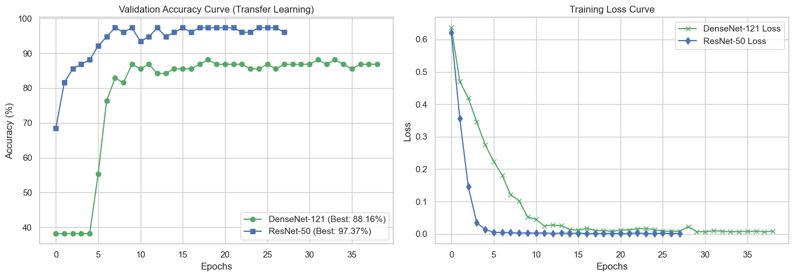

<p align="center">
  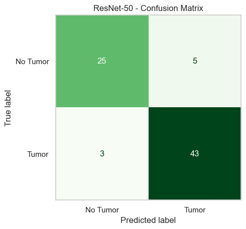
</p>

*Confusion matrix plotted in the notebook. Its title says ResNet-50, but the code plots `metrics_transfer`, which holds the DenseNet-121 results (25 / 5 / 3 / 43 = 89.47%).*

**Interpretation.**

- **ResNet-50 is the clinically safest CNN**: recall 1.00 means no tumor in the test set was missed, with a single false alarm. Its validation accuracy passes 90% within 6 epochs, which shows how much the ImageNet features (edges, contours, textures) transfer to MRI.
- **DenseNet-121 was much slower to start.** Validation accuracy stays at 38% (it predicts only the healthy class) for the first 5 epochs, then plateaus around 87%. With the same learning rate and number of epochs, it did not reach the level of ResNet-50 on this small dataset.

### 6. Vision Transformer (`06_Visual_Transformer`)

A pre-trained ViT-B/16 was fine-tuned on the 224×224 tensors with a very low learning rate (2e-5, batch size 16, early stopping with patience 8).

| Model | Best validation accuracy | Test accuracy | Precision | Recall | F1 |
|---|---:|---:|---:|---:|---:|
| **ViT-B/16** | 98.68% | **100.00%** | 1.0000 | 1.0000 | 1.0000 |

<p align="center">
  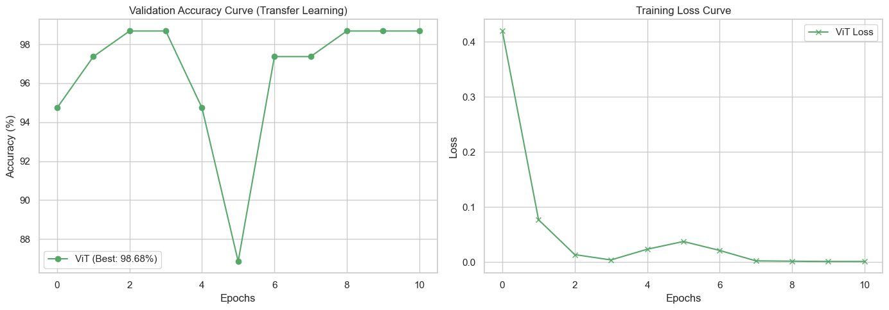
  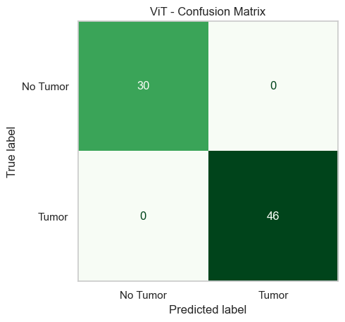
</p>

**Interpretation.** The ViT is already at 94.7% validation accuracy after its first epoch and classifies all 76 test images correctly. Self-attention lets every image patch interact with every other patch, so the model reasons about the whole slice at once (asymmetries, mass effect) rather than through local filters. The dip to 87% at epoch 6 shows that fine-tuning is still sensitive, which is why such a low learning rate was needed.

### 7. Explainability with Grad-CAM (`08_Explanability_AI`)

Grad-CAM heatmaps were computed on the fine-tuned ResNet-50 (target layer `layer2[-1]`) for four tumor samples.

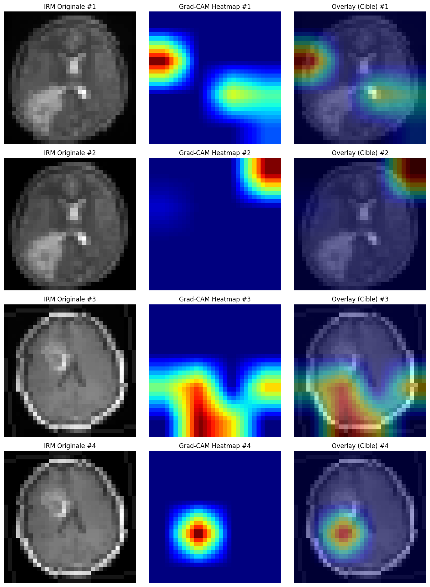

**What the heatmaps show.**

- **Samples 3 and 4**: the activation sits inside the brain, close to the lesion, so the model looks at a plausible Region of Interest.
- **Samples 1 and 2**: the strongest activation lies at the edge of the image or outside the brain, away from the bright lesion in the lower left. The prediction is correct, but probably for the wrong reason (**shortcut learning** on contrast, borders or global asymmetry).
- **Resolution trade-off.** The heatmaps are computed on 32×32 inputs at an intermediate layer: intermediate layers keep more spatial detail but are noisier, while deeper layers are more semantic but blurrier.

Showing the imperfect maps as well as the good ones is deliberate: high accuracy does not by itself prove that the model has learned the pathology.

### Limitations (read before trusting the numbers)

1. **Data leakage from augmentation.** Each MRI is augmented twice *before* the train / validation / test split (`02_preprocessing`), and the split is random over the 504 tensors. Two slightly rotated or flipped copies of the same scan can therefore end up in train and test. Samples 1 and 2 of the Grad-CAM figure are two such copies of the same scan. This mainly benefits the large pre-trained models, which memorize well, and very likely explains part of the 98 to 100% scores.
2. **The same issue for the classical models.** SMOTE and Gaussian noise are applied to the full dataset before the 80 / 20 split, so synthetic samples in the test set are interpolations of training samples.
3. **Very small test sets.** 76 images means a single error moves accuracy by 1.3 points. The ranking between models that are 1 or 2 errors apart is not statistically meaningful, and each model was trained once with a single seed.
4. **Single public dataset.** 253 images from one source, with no information about patients or scanners. Generalization to other hospitals is not tested.

**Next steps to make the results robust:** split by *original image* before augmenting (and apply augmentation only on the fly to the training set), fit SMOTE and PCA on the training fold only, report stratified k-fold cross-validation with mean ± standard deviation, and validate on an external dataset. Larger and more diverse data would also make the Grad-CAM maps more stable and better confined to the lesion.
